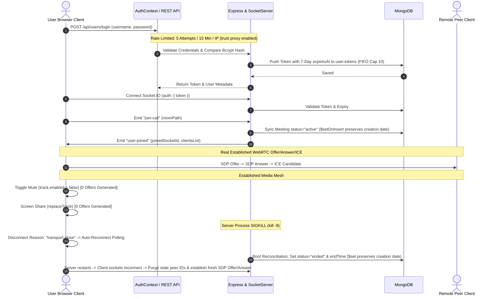

# SyncMeet — Production Documentation & Architecture Reference

SyncMeet is a real-time, peer-to-peer video conferencing and collaboration platform built on the MERN stack (MongoDB, Express.js, React, Node.js), Socket.IO, and WebRTC mesh architecture.

---

## 1. Project Overview & Production Technology Stack

### Core Technologies
- **Frontend Framework**: React 19 + Vite 8
- **Routing**: React Router v7 (`react-router-dom`)
- **UI Components & Styling**: Material-UI (MUI v7), Emotion, Vanilla CSS Modules
- **Real-Time Communication**: WebRTC (`RTCPeerConnection`, `getUserMedia`, `getDisplayMedia`) + Socket.IO v4 Client
- **Backend Runtime**: Node.js (ES Modules `type: "module"`) + Express 5 (`trust proxy: 1`)
- **Database**: MongoDB Atlas / Local MongoDB with Mongoose ODM v9
- **Authentication & Security**: Helmet HTTP security headers, Bcrypt password hashing, 7-day Session Token TTL (`expiresAt`), Bearer Token Middleware, Multi-device session array (FIFO cap 10), Express Rate Limiter (5 requests / 15 min per IP on login), 40kb payload limit, React XSS auto-escaping

---

## 2. Directory & File Structure

```text
SyncMeet/
├── DOCUMENTATION.md                      # Complete End-to-End Technical Documentation
├── backend/
│   ├── .env                              # Backend environment configuration
│   ├── ecosystem.config.cjs              # PM2 process manager configuration
│   ├── nginx.conf                        # Nginx reverse proxy server block with SSL and WebSocket headers
│   ├── package.json                      # Backend dependencies & npm scripts
│   ├── test_full_regression.js           # Live regression runner (Phase 5, 7, 8)
│   ├── test_phase5.js                    # Integration test script for WebRTC & Socket verification
│   ├── test_phase7_real.js               # Established connection WebRTC renegotiation test script
│   ├── test_phase8_real_sigkill.js       # Empirical OS SIGKILL process crash test script
│   ├── test_reconnect_proof.js           # Live empirical auto-reconnect proof test script
│   ├── test_twoparty_reconnect.js        # Two-party WebRTC reconnect recovery test script
│   └── src/
│       ├── app.js                        # Express entry point, Helmet security headers, CORS & Boot reconciliation
│       ├── controllers/
│       │   ├── socketManager.js          # Socket.IO event handlers, room & DB meeting status lifecycle ($setOnInsert)
│       │   └── user.controller.js        # Auth, FIFO session eviction, and Meeting history logic
│       ├── middleware/
│       │   └── auth.middleware.js        # Express authorization middleware & Token expiry validation
│       ├── models/
│       │   ├── meeting.model.js          # Mongoose schema for user meeting history (status: active/ended)
│       │   └── user.model.js             # Mongoose schema for user accounts & tokens array (with expiresAt)
│       └── routes/
│           └── users.routes.js           # REST API routes with Express Rate Limiter
│
└── frontend/
    ├── .env                              # Frontend environment configuration (Vite)
    ├── index.html                        # HTML root template
    ├── package.json                      # Frontend dependencies & npm scripts
    ├── vite.config.js                    # Vite bundler configuration
    └── src/
        ├── App.css                       # Global styles & design system CSS
        ├── App.jsx                       # Main application router component
        ├── index.css                     # Base CSS resets
        ├── main.jsx                      # React application entry point
        ├── assets/                       # Static images & graphics
        ├── contexts/
        │   └── AuthContext.jsx           # Global authentication context & API handler
        ├── pages/
        │   ├── VideoMeet.jsx             # Core WebRTC Video Call room, lobby & reconnect banner
        │   ├── authentication.jsx        # Login & Registration page component
        │   ├── history.jsx               # User meeting activity history component
        │   ├── home.jsx                  # Dashboard landing & code entry component
        │   └── landing.jsx               # Hero marketing landing page component
        ├── styles/
        │   └── videoComponent.module.css # CSS module for VideoMeet component
        └── utils/
            └── withAuth.jsx              # Higher-Order Component (HOC) for route protection
```

---

## 3. End-to-End System Data Flow



---

## 4. Phase 10 — Production Configurations

### A. PM2 Configuration (`backend/ecosystem.config.cjs`)
```javascript
module.exports = {
  apps: [
    {
      name: "syncmeet-backend",
      script: "./src/app.js",
      instances: 1,
      autorestart: true,
      watch: false,
      max_memory_restart: "500M",
      env: {
        NODE_ENV: "production",
        PORT: 8000,
      },
    },
  ],
};
```

### B. Corrected Nginx Production Server Block (`backend/nginx.conf`)
```nginx
# HTTP Server Block: Redirect all HTTP traffic to HTTPS (Required for WebRTC getUserMedia permissions)
server {
    listen 80;
    listen [::]:80;
    server_name syncmeet.yourdomain.com;

    return 301 https://$host$request_uri;
}

# HTTPS Production Server Block
server {
    listen 443 ssl http2;
    listen [::]:443 ssl http2;
    server_name syncmeet.yourdomain.com;

    # SSL TLS Certificate Configuration (Let's Encrypt / Certbot)
    ssl_certificate /etc/letsencrypt/live/syncmeet.yourdomain.com/fullchain.pem;
    ssl_certificate_key /etc/letsencrypt/live/syncmeet.yourdomain.com/privkey.pem;
    ssl_protocols TLSv1.2 TLSv1.3;
    ssl_ciphers HIGH:!aNULL:!MD5;
    ssl_prefer_server_ciphers on;

    # 1. Serve Production Frontend Static Build directly via Nginx root
    root /var/www/syncmeet/frontend/dist;
    index index.html;

    location / {
        try_files $uri $uri/ /index.html;
        proxy_set_header X-Real-IP $remote_addr;
        proxy_set_header X-Forwarded-For $proxy_add_x_forwarded_for;
        proxy_set_header X-Forwarded-Proto $scheme;
    }

    # 2. Proxy Real-Time Socket.IO WebSockets to Backend Node Process (Port 8000)
    location /socket.io/ {
        proxy_pass http://127.0.0.1:8000;
        proxy_http_version 1.1;
        proxy_set_header Upgrade $http_upgrade;
        proxy_set_header Connection "Upgrade";
        proxy_set_header Host $host;
        proxy_set_header X-Real-IP $remote_addr;
        proxy_set_header X-Forwarded-For $proxy_add_x_forwarded_for;
        proxy_set_header X-Forwarded-Proto $scheme;
        proxy_read_timeout 86400;
        proxy_send_timeout 86400;
    }

    # 3. Proxy Express REST API Requests to Backend (Port 8000)
    location /api/ {
        proxy_pass http://127.0.0.1:8000;
        proxy_set_header Host $host;
        proxy_set_header X-Real-IP $remote_addr;
        proxy_set_header X-Forwarded-For $proxy_add_x_forwarded_for;
        proxy_set_header X-Forwarded-Proto $scheme;
        client_max_body_size 40k;
    }
}
```

---

## 5. Verification Commands

```bash
# Run two-party WebRTC reconnect recovery test
cd backend
node test_twoparty_reconnect.js

# Run full regression test suite
node test_full_regression.js

# Frontend production build
cd ../frontend
npm run build
```
