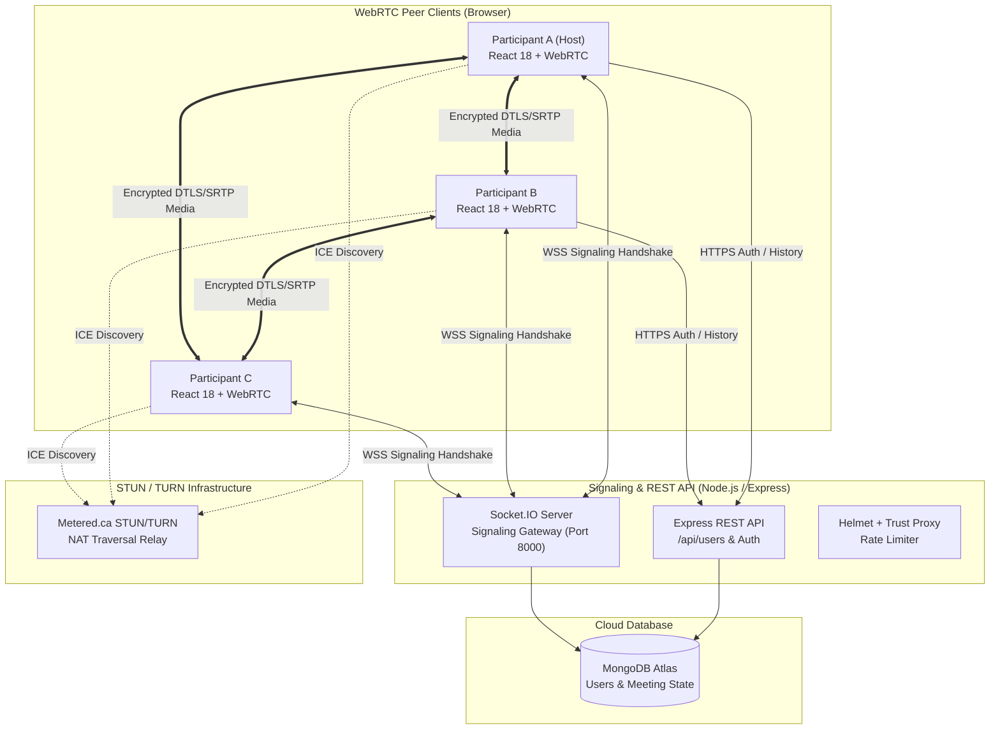
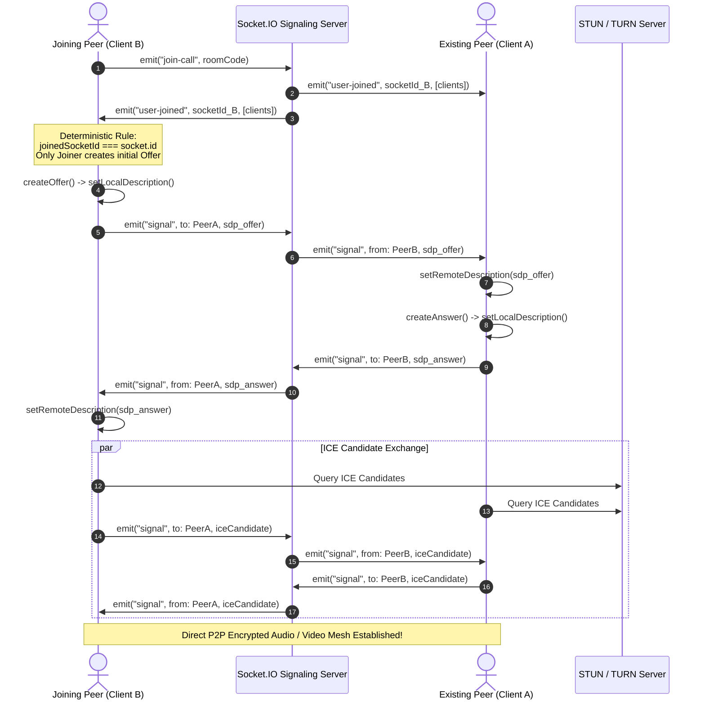

<div align="center">

# ⚡ SyncMeet

### Modern P2P WebRTC Video Conferencing & Real-Time Communication Platform

[](https://sync-meet-eight.vercel.app)
[](https://reactjs.org/)
[](https://vitejs.dev/)
[](https://nodejs.org/)
[](https://socket.io/)
[](https://webrtc.org/)
[](https://www.mongodb.com/)
[](LICENSE)

<p align="center">
  <b>High-quality, low-latency video meetings directly in your browser — zero software downloads or complicated configurations required.</b>
</p>

[Explore Live Demo](https://sync-meet-eight.vercel.app) • [Report Bug](https://github.com/parthkharat20/SyncMeet/issues) • [Request Feature](https://github.com/parthkharat20/SyncMeet/issues)

</div>

---

## 🌟 Key Highlights

- 🌐 **Direct Peer-to-Peer Mesh**: Built with standard WebRTC APIs and deterministic single-offer signaling to eliminate SDP glare and minimize server relay latency.
- 🎨 **SaaS Visual Design System**: Dark neutral surfaces (`#090A10`, `#0F111A`), Discord-inspired Blurple branding (`#5865F2`), Linear-level typography refinement, and subtle 3D kinetic atmosphere.
- 🎥 **Full-Viewport Meeting Stage**: Dynamic auto-scaling video grid (1–6 participants) preserving 16:9 aspect ratios with active speaker detection rings.
- 🖥️ **Seamless Screen Sharing**: Real-time display streaming via `getDisplayMedia` with in-place `RTCRtpSender.replaceTrack()` (zero renegotiation overhead).
- 💬 **In-Call Real-Time Chat**: Live tabbed side drawer with auto-scrolling message bubbles, sender avatars, and participant media statuses.
- 🛡️ **Pre-Call Verification Lobby**: Live camera/microphone preview tile with instant on-preview device toggles before joining calls.
- 🔐 **Secure Authentication & History**: JWT session tokens, bcrypt password hashing, Express rate-limiting, and persistent meeting activity history.

---

## 📐 System Architecture & Data Flow



---

## 🔄 WebRTC Signaling Handshake (Zero-Glare Protocol)

SyncMeet implements a **deterministic offer-creation rule** to guarantee seamless peer connections without SDP offer collisions:



---

## 🛠️ Technology Stack

### **Frontend**
- **Framework**: [React 18](https://react.dev/) + [Vite 8](https://vitejs.dev/)
- **Routing**: [React Router 6](https://reactrouter.com/) (with client-side SPA rewrites)
- **Real-Time Client**: [Socket.IO Client](https://socket.io/docs/v4/client-api/)
- **Styling**: Vanilla CSS Design Tokens ([`tokens.css`](frontend/src/styles/tokens.css)), Google Fonts (*Plus Jakarta Sans*, *Inter*, *JetBrains Mono*)
- **Icons**: [@mui/icons-material](https://mui.com/material-ui/material-icons/)
- **Canvas / 3D**: Custom [`KineticMatrix`](frontend/src/components/ui/KineticMatrix.jsx) with pointer spring physics and CSS perspective tilt

### **Backend**
- **Runtime**: [Node.js](https://nodejs.org/) (ES Modules)
- **Framework**: [Express 4](https://expressjs.com/)
- **WebSocket Engine**: [Socket.IO](https://socket.io/)
- **Database ORM**: [Mongoose](https://mongoosejs.com/) / [MongoDB](https://www.mongodb.com/)
- **Security & Headers**: [Helmet](https://helmetjs.github.io/), CORS, Express Rate Limit, bcrypt, JSON Web Tokens (JWT)

---

## 🚀 Quick Start (Local Development)

### 1. Clone the Repository
```bash
git clone https://github.com/parthkharat20/SyncMeet.git
cd SyncMeet
```

### 2. Configure Environment Variables

**Backend Configuration (`backend/.env`):**
```env
PORT=8000
MONGO_URI=mongodb://127.0.0.1:27017/syncmeet
CLIENT_ORIGIN=http://localhost:5173
JWT_SECRET=your_super_secret_jwt_key
```

**Frontend Configuration (`frontend/.env`):**
```env
VITE_BACKEND_URL=http://localhost:8000
VITE_TURN_USERNAME=your_metered_turn_username
VITE_TURN_PASSWORD=your_metered_turn_password
```

### 3. Install & Run
You can launch both services concurrently from the root directory:

```bash
# Install root dependencies
npm install

# Install backend and frontend dependencies
npm install --prefix backend
npm install --prefix frontend

# Run both backend & frontend concurrently
npm run dev
```

- **Frontend**: `http://localhost:5173`
- **Backend API**: `http://localhost:8000`

---

## 🧪 Automated Testing & Verification

SyncMeet includes a comprehensive integration regression suite verifying WebRTC renegotiation, SDP single-offer generation, role-flipped reconnects, and process crash reconciliation:

```bash
# Run full backend regression test suite
cd backend
npm test
```

```text
==========================================================
      SYNCMEET FINAL PRODUCTION REGRESSION SUITE          
==========================================================
=== RUNNING TEST SUITE 1: PHASE 5 JOIN & SINGLE OFFER CHECK ===
[P5 RESULT] Total SDP Offers Generated on Join: 1 (SUCCESS: Zero Glare)

=== RUNNING TEST SUITE 2: PHASE 7 ESTABLISHED WEBRTC RENEGOTIATION ===
[P7 STATUS] Initial Offers: 1 | Answers: 1 | ICE Candidates: 1 | Established: true
[P7 MUTE RESULT] Offers before: 1 | Offers after: 1 (SUCCESS: 0 new offers)
[P7 SCREEN RESULT] Offers before: 1 | Offers after: 1 (SUCCESS: 0 new offers)

=== RUNNING TEST SUITE 3: PHASE 8 REAL OS PROCESS SIGKILL & RECONCILIATION ===
[P8 DB QUERY AFTER BACKEND RESTART]: { meetingCode: 'P8KILLROOM', status: 'ended' }
SUCCESS: Creation date was preserved untouched! Only endTime was updated on reconciliation.
==========================================================
  ALL REGRESSION TEST SUITES EXECUTED & PASSED CLEANLY    
==========================================================
```

---

## ☁️ Production Deployment Guide

### **Deploying on Railway (Recommended Full Stack)**

1. Create a project on [Railway.com](https://railway.com) and click **Provision MongoDB**.
2. **Backend Service**:
   - Add service from GitHub repo `SyncMeet`.
   - Set **Root Directory** to `/backend`.
   - Set **Variables**: `PORT=8000`, `MONGO_URI=${{MongoDB.MONGO_URL}}`, `CLIENT_ORIGIN=*`.
   - Click **Generate Domain** under Networking (e.g. `https://syncmeet-backend.up.railway.app`).
3. **Frontend Service**:
   - Add another service from GitHub repo `SyncMeet`.
   - Set **Root Directory** to `/frontend`.
   - Set **Variables**: `VITE_BACKEND_URL=https://syncmeet-backend.up.railway.app`.
   - Click **Generate Domain** (e.g. `https://syncmeet.up.railway.app`).

---

## 📁 Repository Structure

```text
SyncMeet/
├── .gitignore                    # Global security & build artifact exclusions
├── package.json                  # Root runner script (build, test, dev, start)
├── README.md                     # Project overview & architecture documentation
├── STYLEGUIDE.md                 # Design tokens & color system reference
├── backend/
│   ├── src/
│   │   ├── app.js                # Express REST API, /health probe, graceful shutdown
│   │   ├── controllers/
│   │   │   ├── socketManager.js  # WebRTC signaling, 6-peer mesh cap, chat sanitization
│   │   │   └── user.controller.js# Authentication & meeting history handlers
│   │   ├── middleware/           # JWT auth & security filters
│   │   ├── models/               # Mongoose models (User, Meeting)
│   │   └── routes/               # API route definitions
│   ├── tests/                    # Integration test suite
│   ├── .env.example              # Sanitized backend environment template
│   └── package.json
└── frontend/
    ├── public/
    │   ├── favicon.svg           # Custom vector brand mark
    │   └── _redirects            # SPA client-side redirect rules
    ├── vercel.json               # Vercel SPA rewrite configuration
    ├── src/
    │   ├── components/
    │   │   ├── ui/               # SyncMeetLogo, KineticMatrix, Button, Card, Input, Badge
    │   │   ├── layout/           # Navbar with avatar status pill & mobile drawer
    │   │   └── features/         # LoginForm, RegisterForm, PasswordStrengthBar
    │   ├── pages/                # Landing, Auth, Home (Dashboard), History, VideoMeet
    │   ├── services/             # Axios API interceptor & Socket.IO client
    │   └── styles/               # tokens.css, global.css, videoComponent.module.css
    ├── .env.example              # Sanitized frontend environment template
    └── package.json
```

---

## 📄 License

This project is licensed under the [MIT License](LICENSE).

---

<div align="center">
  <b>Built with ❤️ by <a href="https://github.com/parthkharat20">Parth Kharat</a></b>
</div>
